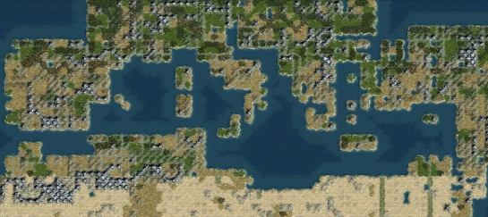
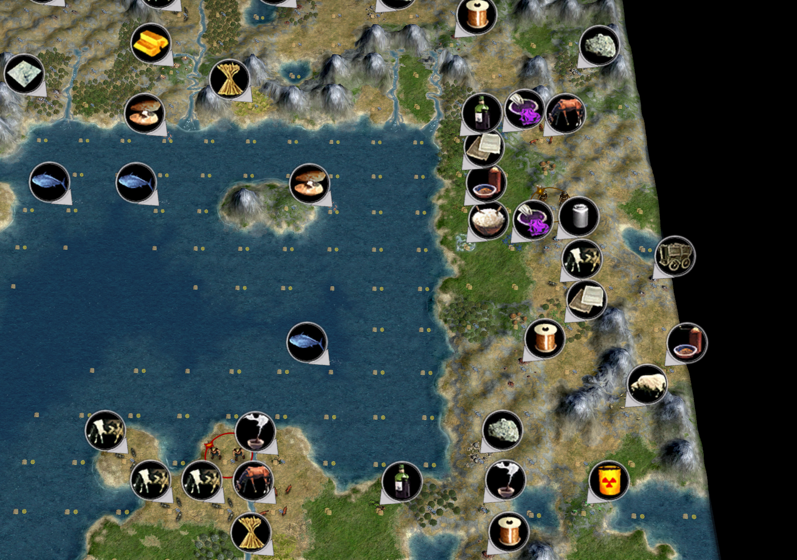
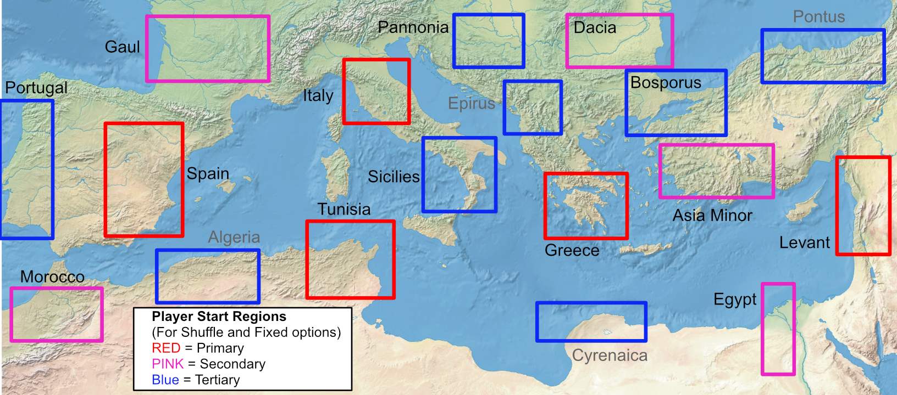
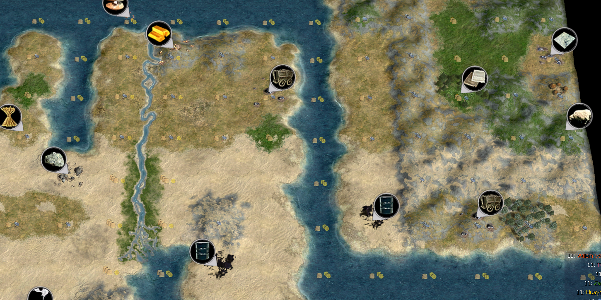
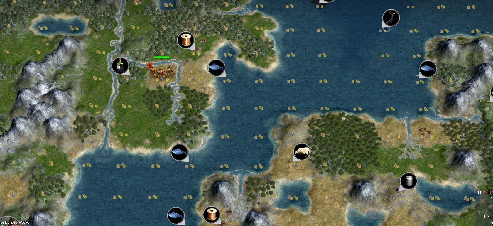
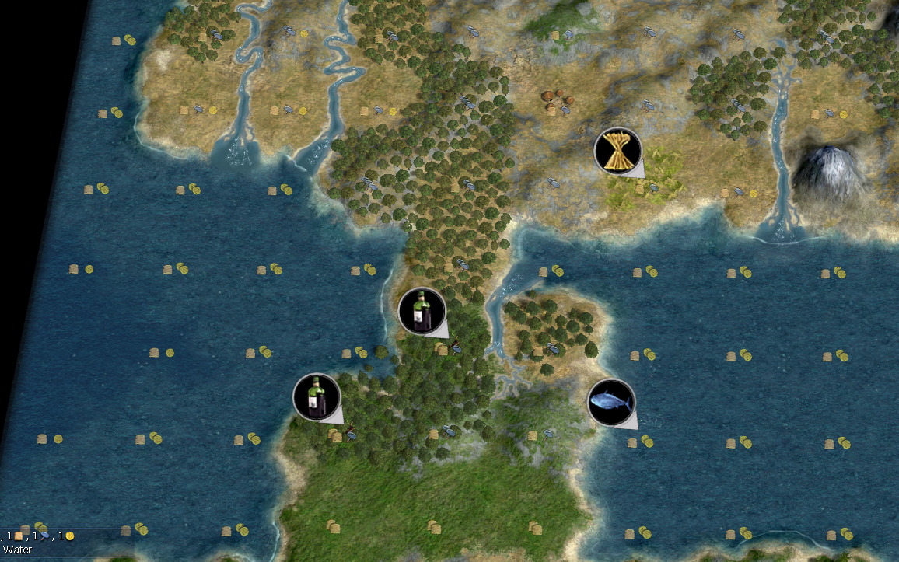

# Description
A Civilization IV mapscript which procedurally generates maps with quasi-realistic Mediterranean geography, climate, and historical starting locations.


<details>
<summary><h3>Screenshots</h3></summary>




</details>


# Instructions
Download Mediterranean_Sea.py from the latest [release.](https://github.com/AineiasStymphalios/Mediterranean_Sea.py/releases)

Add Mediterranean_sea.py to:
- CD version:
```
C:\Program Files\Firaxis Games\Civilization 4\Beyond the Sword\PublicMaps
```

- Steam version:
```
C:\Program Files (x86)\Steam\steamapps\common\Sid Meier's Civilization IV Beyond the Sword\Beyond the Sword\PublicMaps
```
## Version support
This mapscript supports Civ4 Beyond the Sword, Warlords, and Vanilla.

## Mod support
This mapscript should work with most vanilla-like mods (e.g. BUG, BAT, AdvCiv ...).
Mods that _remove_ Civilizations, Bonuses, Terrain etc. may cause unexpected behavior.

# Features
## Map Dimensions
The script generates maps with ratios approximately 2.33:1.
| Map Size | Dimensions |
| :--- | :--- |
| Duel | 36×16 |
| Tiny | 48×20 |
| Small | 60×28 |
| Standard | 72×32 |
| Large | 84×36 |
| Huge | 92×40 |

Gameplay-wise, this should result in empire sizes similar to that of Inland_Sea.py.

## Starting Location Options
- Historical (Fixed): If there are any map-appropriate Vanilla BTS Civilizations in the playerlist, they are placed on fixed regions. Remaining players assignments fall back to the Shuffle method, and then to default methods.
- Historical (Shuffle): Randomly places all players in 5 primary, 5 secondary, and 8 tertiary locations, in order of priority. Remaining players are placed with default methods.
- Vanilla: Default behavior

### Start regions for Shuffle-spawn mode


### Civilizations supported by Fixed-spawn mode
If you include these civilizations to the player list in **Custom Game** and select Historical (fixed) starting locations, they will always start in the following areas of the map.

| Playthrough | Game Identifier | Region | Notes |
| :--- | :--- | :--- | :--- |
| **Classical Civs** | `CIVILIZATION_ROME` | Italy | |
|  | `CIVILIZATION_GREECE` | Greece | |
|  | `CIVILIZATION_CARTHAGE` | Tunisia | |
|  | `CIVILIZATION_PERSIA` | Levant | |
|  | `CIVILIZATION_SPAIN` | Spain | Classical Iberians|
|  | `CIVILIZATION_CELT` | Gaul | |
|  | `CIVILIZATION_EGYPT` | Egypt | |
|  | `CIVILIZATION_MONGOL` | Dacia | Thracians, Scythians, Huns |
|  | `CIVILIZATION_BABYLON` | AsiaMinor | Lydians, Phrygians, Trojans ... |
| **Medieval Civs** | `CIVILIZATION_PORTUGAL` | Portugal | |
|  | `CIVILIZATION_VIKING` | Sicilies | Norman Kingdom of Sicily |
|  | `CIVILIZATION_FRANCE` | Gaul | |
|  | `CIVILIZATION_HOLY_ROMAN` | Pannonia | Austria-Hungary |
|  | `CIVILIZATION_BYZANTIUM` | Bosporus | |
|  | `CIVILIZATION_OTTOMAN` | AsiaMinor | |
|  | `CIVILIZATION_ARABIA` | Levant | |
|  | `CIVILIZATION_MALI` | Morocco | |

## Bonus generation options
- Vanilla: Default behavior (Runs strategic and food bonus checks / additions near starting plots)
- Optional: Semi-historical resource placement
    - Swaps / removes ahistoric resources
      - Removes or Replaces New World, Silk Road, and African resources
    - Region specific bonus placement
      - e.g. adds Silk Road resources in the Levant, Stone to Egypt, Marble to Rome and Greece, Ivory to Carthage

## Landmass Options
Default options are recommended unless one is running AI improvement mods (e.g. k-mod, AdvCiv), as landmasses could become completely blocked.
- Option: Open or close the following straits / Ithmus:
  - Suez
  - Bosporus
  - Gibraltar
- Option: Mountain range settings
  - Realistic: Stronger mountain ranges (Alps, Pyrenees, etc.)
  - Reduced (default): Nerfs mountain ranges

<details>
<summary><h3>Landmass variations</h3></summary>




</details>

## Miscellaneous
- Improved MultilayeredFractal generator, based on Earth2.py
  - Much easier inputs, resolved ton of its technical debt
  - More input properties for regions
- Lattitude-band based Terrain overrides
- Bonus generator
  - Runs strategic and food bonus additions to starting plots
  - Option: Semi-historical resource placement
    - Swaps / removes ahistoric resources
    - Region specific bonus placement
- River generator based on that of Tectonics.py
  - Features river deletion / reduction regions (used to reduce rivers in Sahara desert)
  - Custom north-flowing river generator (used for Nile river)
- Two tile coasts (expandCoastToTwoTiles)

